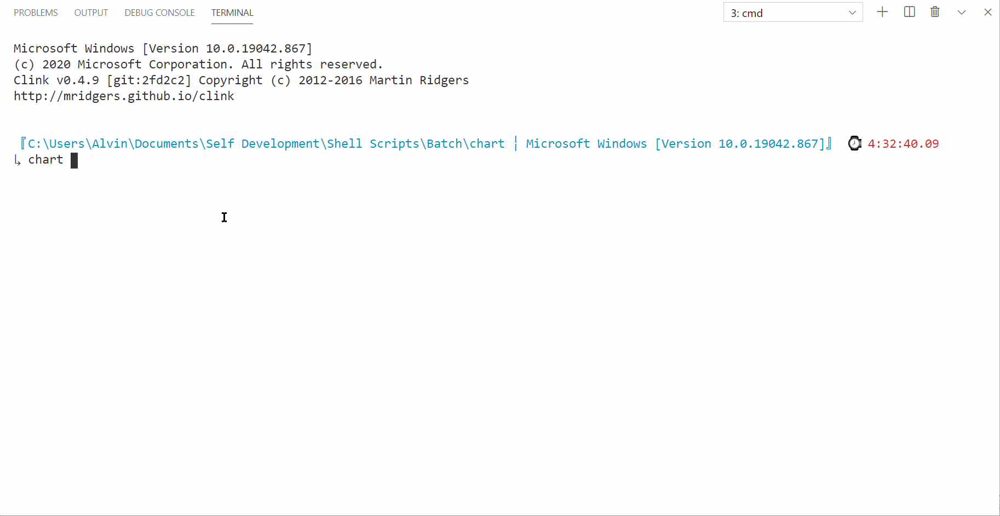

# chart

## Description

simple chart drawer.

## Requirements

Supported environments: Windows 10 and Wine 5.0. Note that coloring on Wine doesn't work.

Command line utils pre-installed:

- [gawk](http://gnuwin32.sourceforge.net/packages/gawk.htm)
- [grep](http://gnuwin32.sourceforge.net/packages/grep.htm)

If these command line utils installed in `C:\Program Files (x86)\GnuWin32\bin` it is not nessesary add them to PATH manually.

## Syntax

```bat
chart [options] [value { [options] } [value { [options] }]...]
```

## Options

- `-h`|`--help` - writes help and exits
- `-v`|`--version` - writes version and exits
- `-i`|`--interactive` - fall in interactive mode
- `-w`|`--width` - chart item width
- `-f`|`--foreground` - specifies --item-foreground for all chart items (user defined values take precedence [Available value set is: black, red, green, yellow, blue, purple, cyan, white, random, random-all.]
- `-b`|`--background` - specifies --item-background for all chart items (user defined values take precedence) [Available value set is: black, red, green, yellow, blue, purple, cyan, white, random, random-all.]
- `-c`|`--char` - specifies --item-char for all chart items (user defined values take precedence)
- `-pc`|`--placeholder-char` - specifies --item-placeholder-char for all chart items (user defined values take precedence)
- `-dm`|`--debug-mode` - enables debug mode

Style options:

- `if`|`--item-foreground` - specifies chart item foreground color
- `ib`|`--item-background` - specifies chart item background color
- `ic`|`--item-char` - specifies chart item char used to display it
- `ipc`|`--item-placeholder`-char - specifies chart item placeholder char used to display it

Interactive mode commands:

- `q`|`quit` - exits
- `c`|`clear` - clears screen
- `h`|`help` - writes help

## Error codes

- `0` - Success
- `10` - gawk utility not found to perform calculations with float numbers.
- `11` - grep utility not found to perform string search.
- `20` - Unexpected value instead of nonnegative number while expanding --foreground|--background|--char|--placeholder-char."
- `30` - Unexpected value instead of nonnegative number while expanding random colors.
- `40` - No data provided to draw chart.
- `50` - Unexpected value instead of nonnegative number.
- `60` - Missing opening curly brace ({).
- `61` - Missing closing curly brace (}).
- `70` - Unexpected foreground color name. Valid color name set is: black (default), red, green, yellow, blue, purple, cyan, white, random.
- `80` - Unexpected background color name. Valid color name set is: black (default), red, green, yellow, blue, purple, cyan, white, random.

## Examples

```bat
chart --help
```

```bat
chart 1 5 3
```

```bat
chart 1 { --item-foreground red } 5 { --item-foreground green } 3 { --item-foreground blue }
```

```bat
chart --foreground red 1 2 3
```


